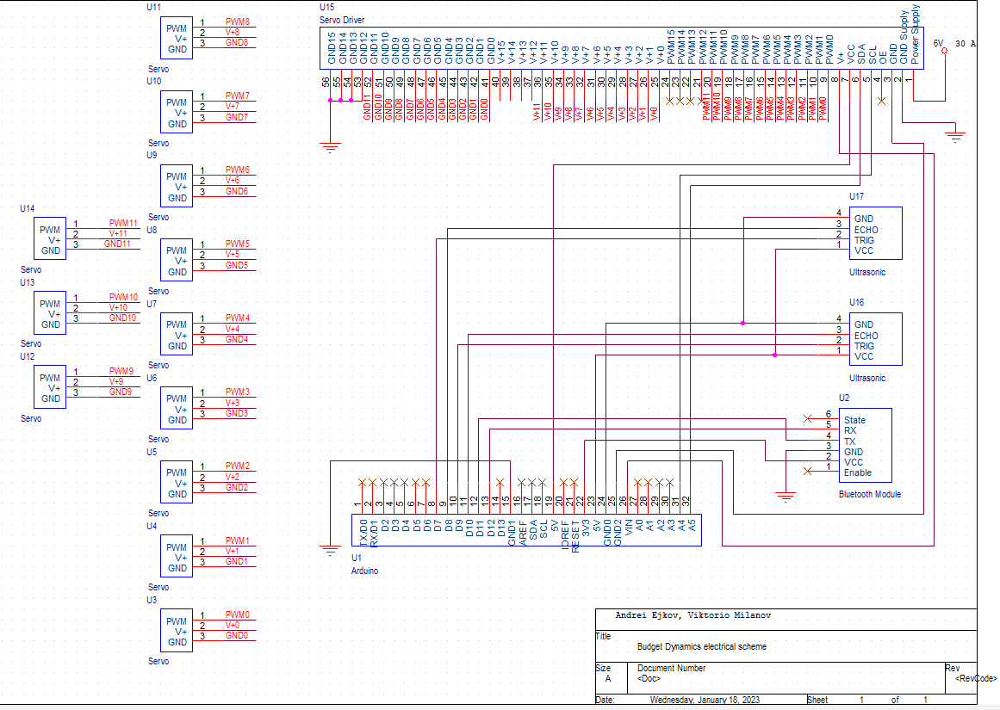

# MECHKA
## By Budget Dynamics

MECHKA е четирикрак робот, който е създаден от екип Budget Dynamics. Той може да изпълнява различни интересни и полезни функции. Роботът има приложения в индустрията и образованието. Контролира се от мобилно приложение чрез Bluetooth. Проекта поначало е курсов проект по дисциплината "Вградени микрокомпютърни системи", но екипът участва с него и във ТУЕС Фест 2023, както и е приет с MECHKA в "PARA Robotics Incubator" сезон 2.

## Съдържание
 
1. [Функции](#функции)  
2. [Документация на проекта](#Документация-на-проекта)       
3. [Презентация](#презентация)  
4. [Demо](#Demo)     
5. [Технологии](#Технологии)     
6. [Електрическа схема](#Електрическа-схема)   
7. [3D Модел на тялото](#3D-Модел-на-тялото)  
8. [ТУЕС Фест постер](#ТУЕС-Фест-постер)    
9. [Екипът Budget Dynamics](#Budget-Dynamics)  

## Функции

- Управление от мобилно приложение
- Изправяне, клякане
- Ходене
- Специални функции

## Документация на проекта

[Документация](https://docs.google.com/document/d/1ljFhPLfK0vJMqwFt7CCxIXQy4T2rVfxQFEeq_DpqxoI/edit)

## Презентация

[Презентация](https://docs.google.com/presentation/d/1ao5GaoYlJ3WwoU5Bq-MMPqkvP_JQxsr8S0_cT7X9GHs/edit#slide=id.g20fd7a13fe7_0_95)

## Demo

[Демонстрация](https://www.youtube.com/watch?v=mcv_eNT28IA&t=1s&ab_channel=%D0%A2%D0%A3%D0%95%D0%A1)

## Технологии

- **Много математика**
- **Arduino Uno**
- **C/C++**
- **Android studio**
- **Java**

## Електрическа схема

## 3D Модел на тялото

## ТУЕС Фест постер

## Budget Dynamics

- [@Андрей Ежков](https://www.github.com/AnMe3z)
- [@Викторио Миланов](https://www.github.com/bigIq)

