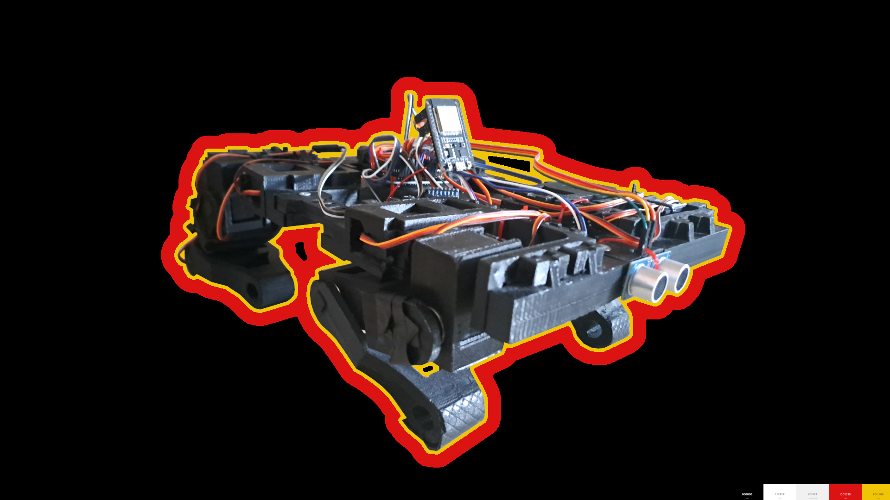
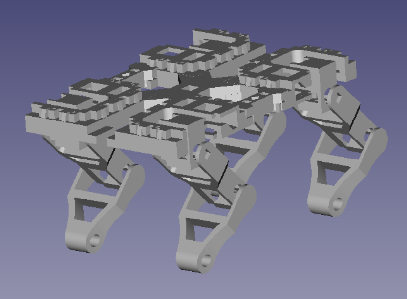

# MECHKA
## By Budget Dynamics

MECHKA е четирикрак модуларен робот създаден от екип Budget Dynamics. Той може да изпълнява различни интересни и полезни функции. Роботът приложения в индустрията и образованието. Контролира се от мобилно приложение чрез Bluetooth. 

## Функции

- Управление от мобилно приложение
- Изправяне, клякане
- Ходене
- Специални функции

## 3D Модел на тялото

## ТУЕС Фест постер

## Документация на проекта

[Документация](https://docs.google.com/document/d/1ljFhPLfK0vJMqwFt7CCxIXQy4T2rVfxQFEeq_DpqxoI/edit)

## Budget Dynamics

- [@Андрей Ежков](https://www.github.com/AnMe3z)
- [@Викторио Миланов](https://www.github.com/bigIq)

