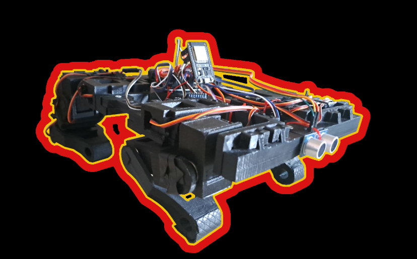

# MECHKA
## By Budget Dynamics

MECHKA е четирикрак робот създаден от екип Budget Dynamics. Той може да изпълнява различни интересни и полезни функции. Роботът приложения в индустрията и образованието. Контролира се от мобилно приложение чрез Bluetooth. 

## Съдържание
 
[Функции](#функции)  
[Презентация](#презентация)  
[Demо](#Demo)  
[Електрическа схема](#Електрическа-схема)   
[3D Модел на тялото](#3D-Модел-на-тялото)  
[ТУЕС Фест постер](#ТУЕС-Фест-постер)  
[Документация на проекта](#Документация-на-проекта)  
[Екипът Budget Dynamics](#Budget-Dynamics)  
## Функции

- Управление от мобилно приложение
- Изправяне, клякане
- Ходене
- Специални функции

## Презентация

[Презентация](https://docs.google.com/presentation/d/1ao5GaoYlJ3WwoU5Bq-MMPqkvP_JQxsr8S0_cT7X9GHs/edit#slide=id.g22d9616c669_1_0)

## Demo

[Демонстрация](https://www.youtube.com/watch?v=mcv_eNT28IA&t=1s&ab_channel=%D0%A2%D0%A3%D0%95%D0%A1)

## Електрическа схема

## 3D Модел на тялото

## ТУЕС Фест постер

## Документация на проекта

[Документация](https://docs.google.com/document/d/1ljFhPLfK0vJMqwFt7CCxIXQy4T2rVfxQFEeq_DpqxoI/edit)

## Budget Dynamics

- [@Андрей Ежков](https://www.github.com/AnMe3z)
- [@Викторио Миланов](https://www.github.com/bigIq)

